# [笔记]在GitHub Page上部署网页和搭建博客

本篇记录了如何通过GitHub Page发布个人网页，以及搭建静态博客，也就是CMS(内容管理系统)。所以适合以下设计师阅读：

1. 有一定前端知识或者会使用Markdown语法；
2. 想在网页上显示点什么又不想麻烦去折腾域名和服务器；
3. 有Mac电脑，我还没研究Windows。

相关文章有很多，官网也写得很详细，我只是想写得更简单一些，也有利于自己总结和日后查阅。

以下正文：

---
##1.起源
最早学习前端的时候就写过一些页面，也想自己部署到服务器上，但是又不想折腾域名和服务器（域名要购买还要备案，服务器也需要购买）。所以一直没有做这件事，准备简历的时候放的也是本地的代码。

直到前两天，因为公司官网下线无法访问（公司官网是我写的一个静态页面），所以才想是否还有别的方式可以展示，于是找到这么个神器GitHub Page。GitHub都不陌生，毕竟~~全球最大男性交友网站~~世界上最大的代码存放网站和开源社区[1](https://zh.wikipedia.org/wiki/GitHub)。它旗下GitHub Page更是可以免费托管你的静态页面，虽说空间不限，但据说体积要控制在1G以下[2](https://www.zhihu.com/question/21282780)。

折腾了半天总算是成功发布了页面，[官方文档](https://pages.github.com/)介绍得也非常详细，以下是我操作过后的具体步骤。

## 2.注册GitHub账号

注册地址：[https://github.com/join?source=login](https://github.com/join?source=login)

自行注册。

##3.创建Git仓库（Repository）

点击右上角的加号创建仓库

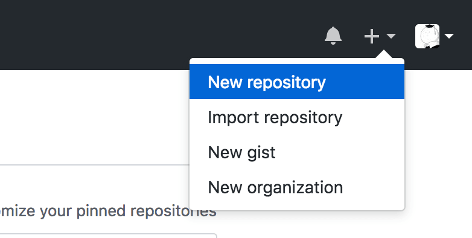

填写仓库名称就可以点击下面的绿色按钮创建了。

其中：

- Description——仓库描述，选填；
- Public，Private——GitHub限制免费用户只能创建公开仓库；
- Initialize this repository with a README——初始化仓库时添加README，readme是一个说明文件，用markdown语法编写，打上勾的话就默认添加了这个文件，如果不打勾后期也可以自己添加；


##3.本地配置Git

创建好仓库后显示下图页面，点击红框标记按钮复制仓库地址。

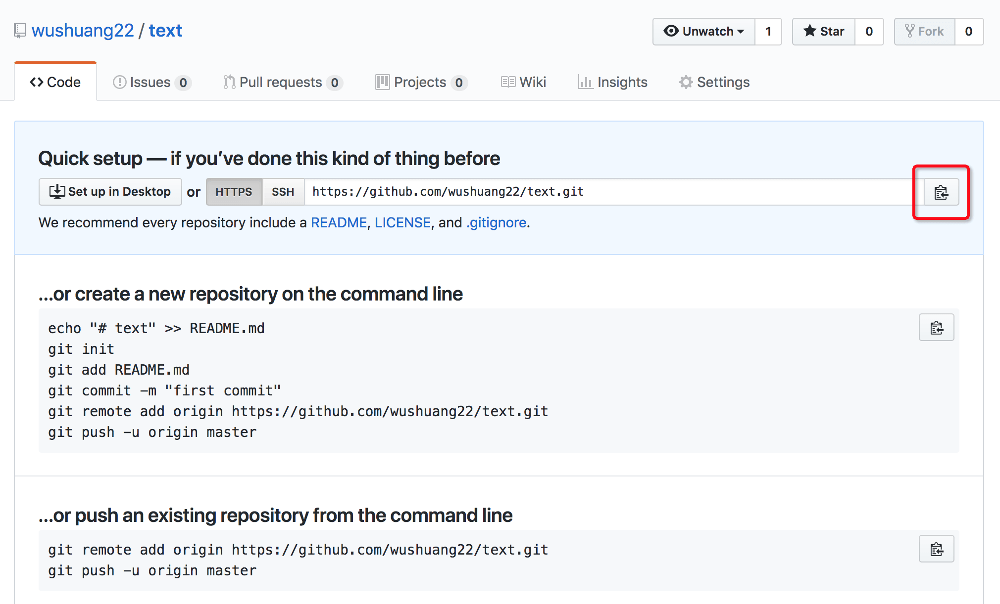

这时候需要用到Git命令了 ，Git是一个分布式版本控制软件[3](https://zh.wikipedia.org/wiki/Git)，我们就通过Git命令来同步和管理代码。

Git的安装参考这篇文章：[安装Git](https://www.liaoxuefeng.com/wiki/0013739516305929606dd18361248578c67b8067c8c017b000/00137396287703354d8c6c01c904c7d9ff056ae23da865a000
)

安装好之后初次运行Git需要做一些配置：

1. 打开系统自带的Terminal；

   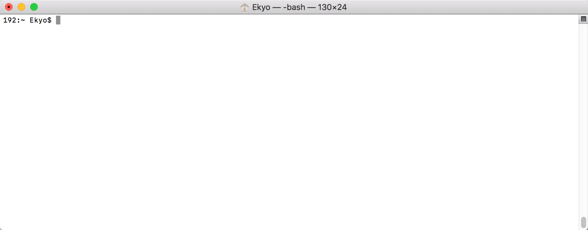

2. 设置username和email，github每次commit（提交代码）都会记录他们，在Terminal中分别输入以下代码；
	

```
git config --global user.name "你的用户名"
git config --global user.email "你的邮箱"
```

3. 一般来说这样就可以了，如果考虑到传输安全的问题，可以考虑加上SSH协议，具体操作可以搜索“SSH keys Git”关键词。

## 4.克隆云端仓库到本地

配置完Git之后，选择一个本地文件夹来存放你的云端仓库，回头要把云端的仓库克隆到这里。比如下图我选择了**Front**这个文件夹。

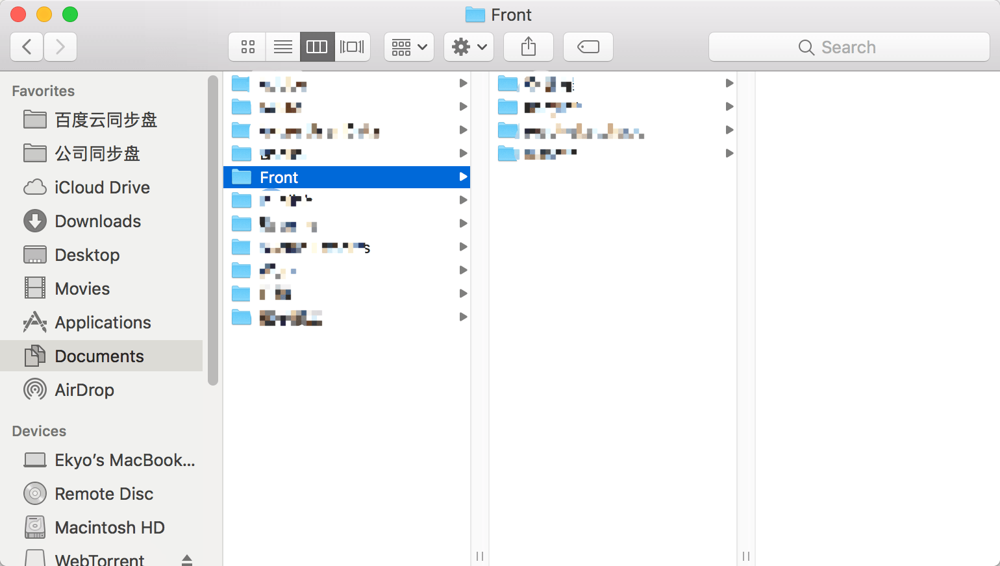

输入以下命令，其中cd（Change directory）意为切换目录到...：

```
cd 文件夹地址
```

其中文件夹地址不一定要手输，直接把文件夹拖到Terminal里面也行，按下回车。


再输入以下代码把云端仓库克隆下来，仓库地址为之前第3步复制下来的地址。

```
git clone 仓库地址
```

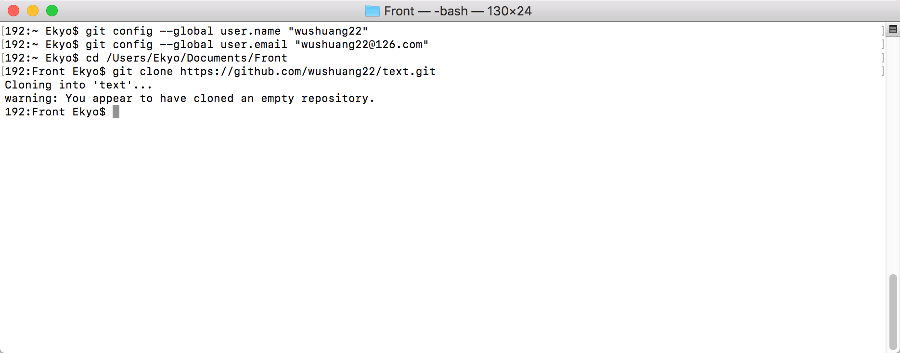

此时你的仓库根目录下应该已经有克隆下来的仓库了，仓库里什么也没有。

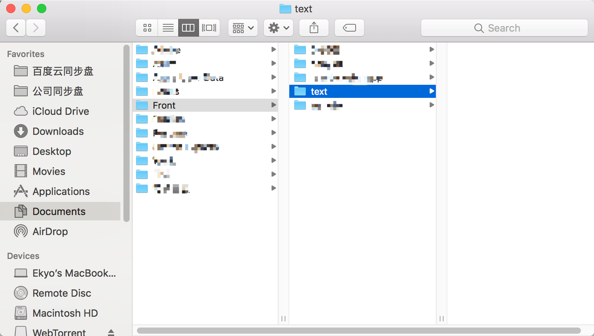

## 5.上传文件到云端仓库

到这步，我们需要在本地库中添加些东西，官方文档中是直接用命令把文件写进去：

1. 首先切换本地目录到克隆下来的库；

   ```
   cd 库标题
   ```

   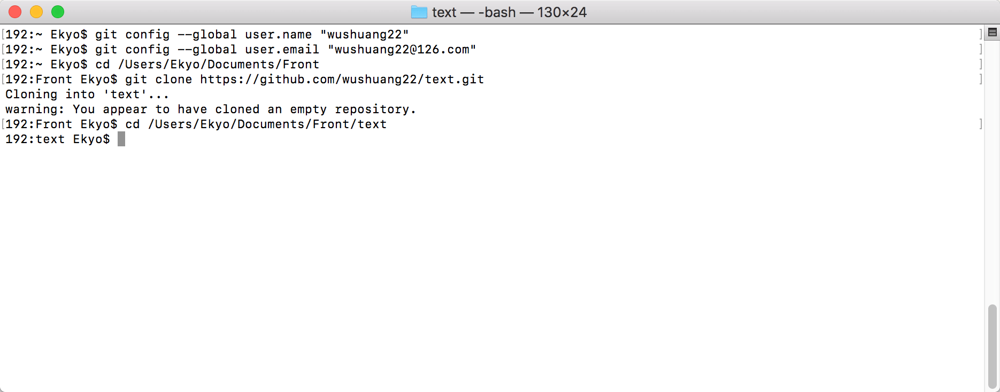

2. 新建一个index.html文件，并在里面写入Hello World。

   ```
   echo "Hello World" > index.html
   ```

   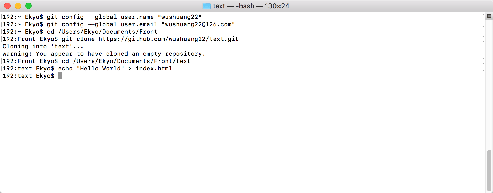

   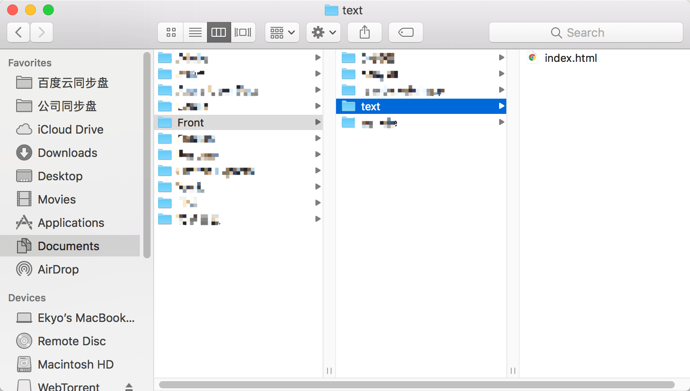

当然我们也可以直接把文件拷到到本地库文件夹下，或者在里面创建。注意这个文件夹下一定要有一个index.html文件，这里默认读者会点html，不解释了。

接下来就可以把文件上传到云端仓库了，在Terminal中输入以下命令：
1. 把该文件夹下所有文件纳入版本管理；
  ```
  git add .
  ```

  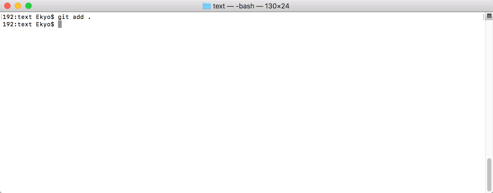

2. commit代码，把代码的一个版本提交到本地；

   ```
   git commit -m "版本日志"
   ```

   

3. push代码，把代码推（上传）到云端仓库，稍等一会儿就好了。

   ```
   git push -u origin master
   ```

   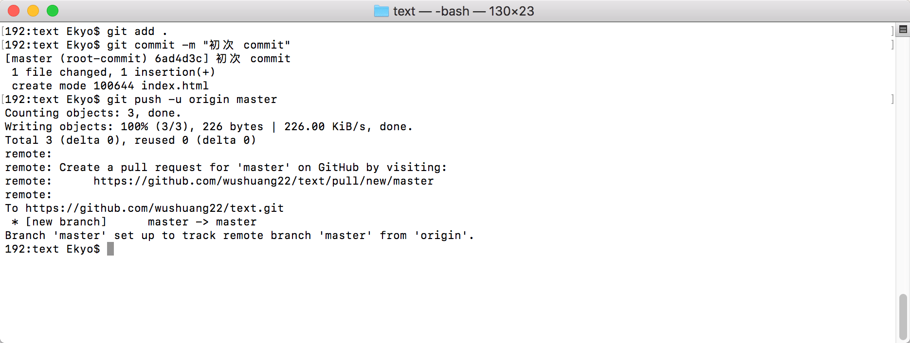

##6.设置GitHub Pages

这时我们已经成功将index.html文件推到云端仓库了，再一步就能大功告成，点击下图红框标记进入Setting页面：

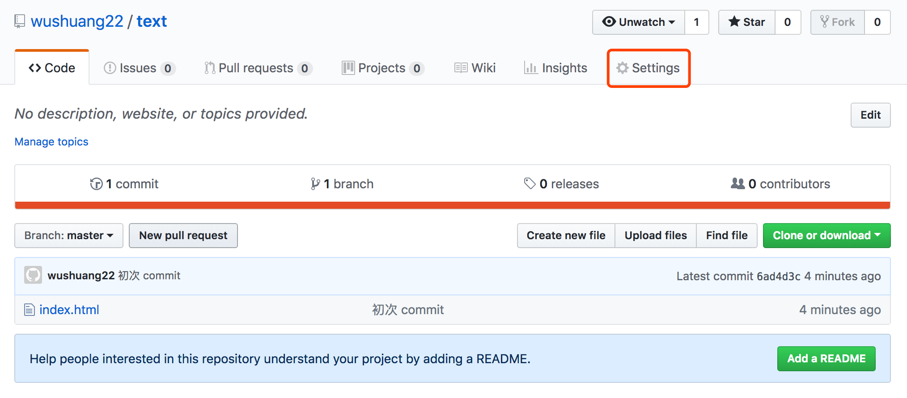

拉到下面的GitHub Pages部分，按下图所示选择master branch（主分支），点击save。


刷新页面之后再回到GitHub Pages部分，可以看到页面已经发布，点击链接进入就大功告成啦！

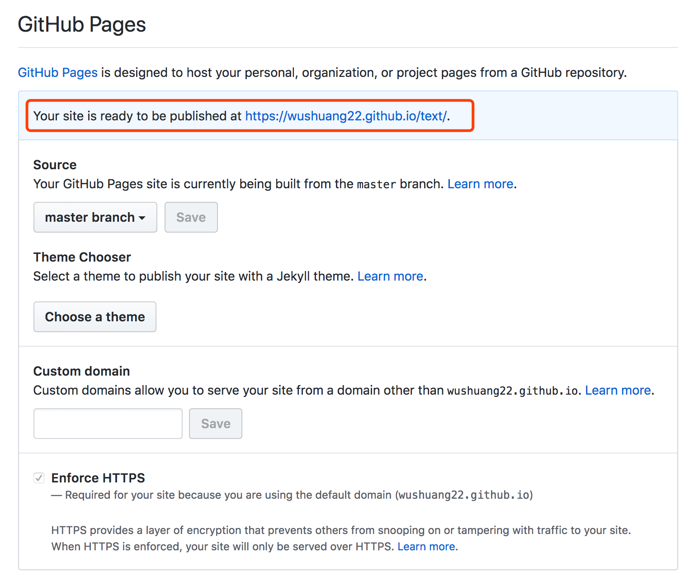

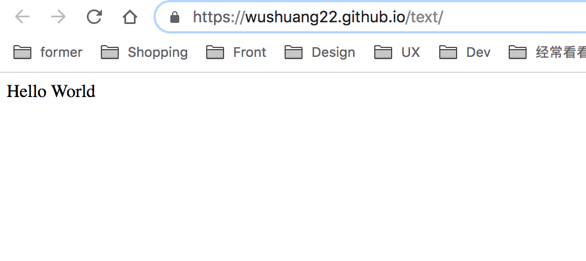

## 6.结尾

后续的修改只需要重复第5步就可以了，代码如下：

```
cd 本地库目录
git add .
git commit -m "版本日志"
git push -u origin master
```

好像写得有点啰嗦了，因为是第一篇关于GitHub的文章所以尽量介绍详细点，避免日后查。

GitHub还有很多好功能有待开发，善于利用搜索引擎，have fun~


---


参考文章

1. [MAC上Git安装与GitHub基本使用](https://www.jianshu.com/p/7edb6b838a2e)
2. [Linux常用命令英文全称与中文解释Linux系统](http://mark-ztw.iteye.com/blog/1544367)
```

```